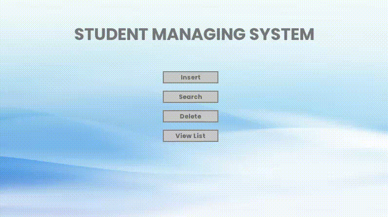

# Ordered List with Variable Size and Overlap


## Overview

This project was developed during our second year in the **File Structure and Data Structure** module. The primary objective was to implement a visualisation and data structure in a file with records, specifically focusing on an **ordered list with variable size and overlap**. The project was built using **C** and the **Raylib** library, with support for both Linux and Windows platforms.

## Features

- **Ordered List**: Implements an ordered list where elements are stored in a specific sequence.
- **Variable Size Records**: Each record in the list can have a variable size.
- **Overlap Handling**: Efficient management and handling of overlapping records.
- **Cross-Platform Build**: Supports building on both Linux and Windows.

## Screenshots



## Table of Contents

- [Installation](#installation)
- [Usage](#usage)
- [Project Structure](#project-structure)
- [Dependencies](#dependencies)
- [Contributors](#contributors)

## Installation

### Prerequisites

- **C Compiler**: GCC for Linux, MinGW for Windows

### Linux

1.  Clone the repository :

    ```bash
        git clone https://github.com/edaywalid/LOVC_SFSD
        cd LOVC_SFSD
    ```

2.  Build and Run the project :

        ./build/build.sh

### Windows

1.  Clone the repository :

    ```bash
        git clone https://github.com/edaywalid/LOVC_SFSD
        cd LOVC_SFSD
    ```

2.  Build and Run the project :

        ./build/build.bat

## Usage

After building the project, you can run the executable to start the application. The application provides functionalities to add, remove, and manage records within the ordered list. Detailed usage instructions will be provided within the application interface.

## Project Structure

    ├── background
    │   ├── ...
    ├── build
    │   ├── build.bat
    │   └── build.sh
    ├── debug
    │   └── myprogram.exe
    ├── fonts
    │   └── poppins
    |		├── ...
    ├── include
    │   ├── raygui.h
    │   └── ...
    ├── README.md
    ├── sound
    │   └── ...
    ├── src
    │   ├── abstract.c
    │   ├── index.c
    │   └── main.c
    └── Wlib
        └── libraylib.a

## Dependencies

- **Raylib**: [Raylib Official Site](https://www.raylib.com/)
- **C Standard Library**

## Contributors

- **BECHAR WALID (me)** - [@edaywalid](https://github.com/edaywalid)
- **KECIRA ABDERRAOUF** - [@Albaforce](https://github.com/Albaforce)
- **RACHEDI ABDERRAHMANE** - [@Rach17](https://github.com/Rach17)
